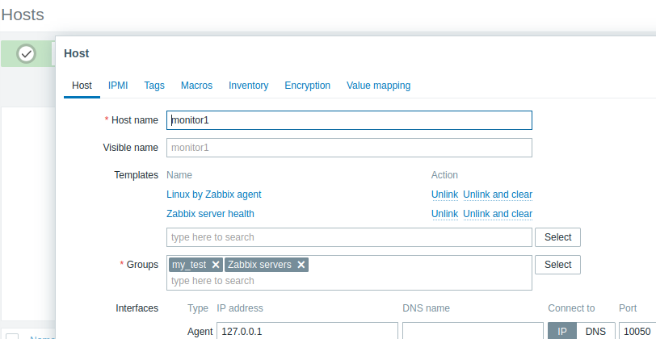
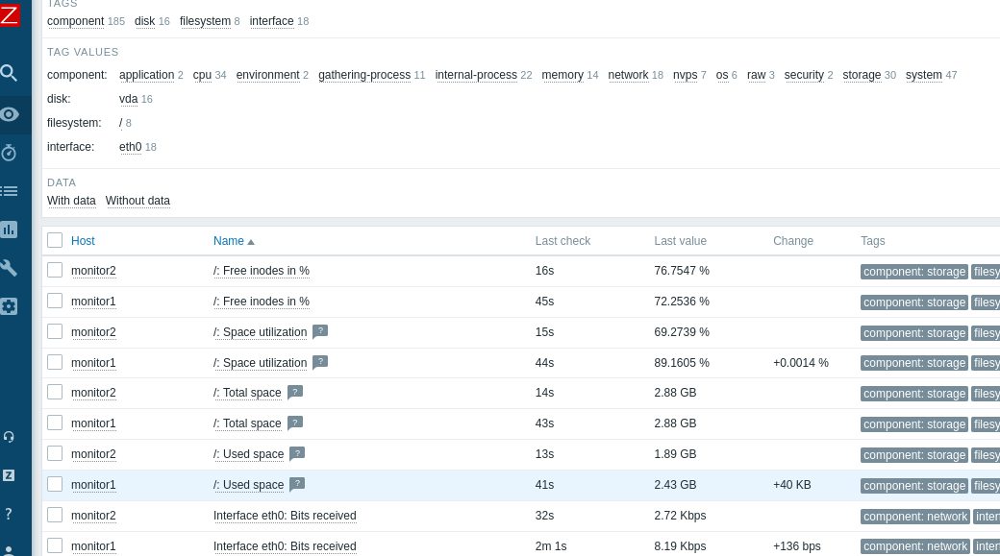
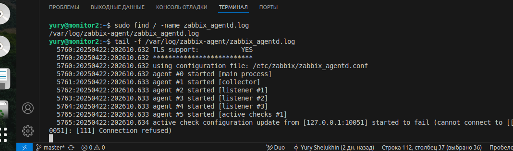

# Домашнее задание к занятию «Zabbix» Шелухин Юрий

### Задание 1

Установите Zabbix Server с веб-интерфейсом.

Процесс выполнения:
1. Выполняя ДЗ, сверяйтесь с процессом отражённым в записи лекции.
2. Установите PostgreSQL. Для установки достаточна та версия, что есть в системном репозитороии Debian 11.
3. Пользуясь конфигуратором команд с официального сайта, составьте набор команд для установки последней версии Zabbix с поддержкой PostgreSQL и Apache.
4. Выполните все необходимые команды для установки Zabbix Server и Zabbix Web Server.  

Требования к результатам:
1. Прикрепите в файл README.md скриншот авторизации в админке.
2. Приложите в файл README.md текст использованных команд в GitHub

## Решение 1

1.  Установим PostgreSQL:  
sudo apt install postgresql   
sudo apt update  
Установим репозиторий Zabbix. Перечень команд возьмем на сайте https://www.zabbix.com/ru/download?zabbix=6.0&os_distribution=debian&os_version=11&components=server_frontend_agent&db=pgsql&ws=apache исходя их конфигурации нашей ВМ.  
sudo wget https://repo.zabbix.com/zabbix/6.0/debian/pool/main/z/zabbix-release/zabbix-release_latest_6.0+debian11_all.deb
sudo dpkg -i zabbix-release_latest_6.0+debian11_all.deb  
sudo apt update  
Установим Zabbix сервер, веб-интерфейс и агент  
apt install zabbix-server-pgsql zabbix-frontend-php php7.4-pgsql zabbix-apache-conf zabbix-sql-scripts zabbix-agent  
проверим
sudo systemctl status zabbix-server.service  
  
установлен, но не запущен
Создаlbv базу данных  
Создадим пользователя zabbix    
sudo -u postgres createuser --pwprompt zabbix  
Создадим базу zabbix для пользователя zabbix    
sudo -u postgres createdb -O zabbix zabbix  
На хосте Zabbix сервера импортируем начальную схему и данные.   
zcat /usr/share/zabbix-sql-scripts/postgresql/server.sql.gz | sudo -u zabbix psql zabbix  
Отредактируем файл /etc/zabbix/zabbix_server.conf  
sudo vim /etc/zabbix/zabbix_server.conf  
      
Запустим процессы Zabbix сервера и агента, настроим их запуск при загрузке ОС.    
systemctl restart zabbix-server zabbix-agent apache2    
systemctl enable zabbix-server zabbix-agent apache2  
   
  
http://51.250.46.43/zabbix проверим, все параметры в статусе- ок
   
   

---

### Задание 2

Установите Zabbix Agent на два хоста.

Процесс выполнения:
1. Выполняя ДЗ, сверяйтесь с процессом отражённым в записи лекции.
2. Установите Zabbix Agent на 2 вирт.машины, одной из них может быть ваш Zabbix Server.
3. Выполняя ДЗ, сверяйтесь с процессом отражённым в записи лекции.
4. Добавьте Zabbix Server в список  разрешенных серверов ваших Zabbix Agentов.
5. Добавьте Zabbix Agentов в раздел Configuration > Hosts вашего Zabbix Servera.
6. Проверьте, что в разделе Latest Data начали появляться данные с добавленных агентов.  

Требования к результатам:
1. Приложите в файл README.md скриншот раздела Configuration > Hosts, где видно, что агенты подключены к серверу
2. Приложите в файл README.md скриншот лога zabbix agent, где видно, что он работает с сервером
3. Приложите в файл README.md скриншот раздела Monitoring > Latest data для обоих хостов, где видны поступающие от агентов данные.
4. Приложите в файл README.md текст использованных команд в GitHub  

## Решение 2  

1-3. Установим агента  
sudo apt update  
sudo  apt install zabbix-agent  
Запустим процесс Zabbix агент и настром его запуск при загрузке ОС.  
systemctl restart zabbix-agent   
systemc status zabbix-agent   
    
добавляем хост    
    
   
сохраним и вновь зайдем на хост для начала наблюдения путем добавдения метрик  
выберем стандартный шаблон  
   
     
сервер не соединился с агентом ввиду отсутствия допуска. отредактируем конфигурационный файл  
sudo find / -name zabbix_agentd.conf  
sudo vim...  
   
перезапустим и проверим  
sudo systemctl syatus zabbix-agent.service  
sudo systemctl status zabbix-agent.service  
проверим на веб-сервере  
     
  
     
  
проверим логи  
sudo find / -name zabbix_agentd.log  
  

---

## Задание 3 со звёздочкой*

Установите Zabbix Agent на Windows (компьютер) и подключите его к серверу Zabbix.

Требования к результатам
1. Приложите в файл README.md скриншот раздела Latest Data, где видно свободное место на диске C:
